# RAV-21 Semantic Retrieval MVP

RAV-21 Semantic Retrieval là pipeline thử nghiệm dùng Gemini để phân tích video camera hành trình, chuyển nội dung của từng scene thành metadata có cấu trúc, tạo văn bản phục vụ truy hồi, sinh vector embedding và xây dựng chỉ mục FAISS.

Project tập trung vào các khái niệm thường gặp trong dữ liệu xe tự hành:

- tác nhân giao thông như ô tô, người đi bộ, xe đạp và xe tải;
- hành động như rẽ, dừng, sang làn và băng qua đường;
- vị trí như làn đường, vạch qua đường và giao lộ;
- quan hệ giữa các tác nhân;
- sự kiện theo thời gian và các tình huống nguy hiểm;
- bối cảnh đường, thời tiết và thời điểm trong ngày.

Đây là MVP cho bước tạo dữ liệu truy hồi. Project hiện có thể tạo metadata, corpus, embedding và FAISS index; chưa có CLI hoàn chỉnh để nhập câu hỏi và tìm kiếm trong index.

## Kiến trúc

```mermaid
flowchart LR
    A[Video MP4 theo scene] --> B[Đọc thông tin video và lấy các mốc thời gian]
    B --> C[Upload video lên Gemini Files API]
    C --> D[Gemini phân tích video với structured output]
    D --> E[Pydantic validate và chuẩn hóa taxonomy]
    E --> F[semantic_metadata.json]
    F --> G[semantic_corpus.jsonl]
    G --> H[Hash embedding 384 chiều]
    H --> I[embeddings.parquet và id_map.parquet]
    I --> J[FAISS IndexFlatIP]
```



Pipeline được chia thành ba giai đoạn độc lập:

1. **Semantic extraction:** video → metadata JSON bằng Gemini.
2. **Embedding:** `searchable_text` → vector chuẩn hóa.
3. **Indexing:** vector → FAISS `IndexFlatIP`.

## Tính năng hiện tại

- Xử lý một scene hoặc toàn bộ thư mục `scene-*`.
- Upload mỗi video một lần trong một lượt chạy và tái sử dụng file đã upload khi retry.
- Yêu cầu Gemini trả structured output theo Pydantic schema.
- Chuẩn hóa nhãn theo taxonomy `road-v1`.
- Tương thích với kết quả Gemini cũ trả `events` hoặc `relations` dưới dạng chuỗi.
- Retry có giới hạn, exponential backoff và jitter cho lỗi tạm thời.
- Chuyển model khi gặp `404` hoặc `503`.
- Ghi provenance gồm model, prompt, taxonomy và pipeline version.
- Ghi thời gian xử lý từng scene dưới dạng giây và `HH:MM:SS.mmm`.
- Bỏ qua scene đã có artifact, trừ khi chạy với `--force`.
- Tạo corpus JSONL, embedding Parquet và FAISS index có manifest.
- Có test độc lập, không cần gọi Gemini API thật.

## Cấu trúc thư mục

```text
.
├── config/
│   └── retrieval.yaml             # Cấu hình input/output cho semantic pipeline
├── data/
│   └── scene-0061/
│       └── cam_front.mp4           # Video đầu vào mẫu
├── pipeline/
│   └── retrieval/
│       ├── embedder.py             # Hash embedding baseline
│       ├── faiss_index.py          # Xây dựng IndexFlatIP
│       ├── frame_sampler.py        # Tính các mốc thời gian đại diện
│       ├── gemini_vlm.py           # Gemini client, retry và model fallback
│       ├── prompts.py              # Prompt và prompt version
│       ├── schemas.py              # Pydantic schema và normalization
│       ├── searchable_text.py      # Sinh text dùng cho retrieval
│       ├── semantic_pipeline.py    # Điều phối xử lý scene và tạo corpus
│       └── taxonomy.py             # Controlled vocabulary
├── scripts/
│   ├── run_semantic_pipeline.py    # Entry point xử lý video
│   ├── build_embeddings.py         # Tạo vector embedding
│   └── build_faiss_index.py        # Tạo FAISS index
├── tests/                          # Unit test
├── artifacts/                      # Kết quả sinh ra, không commit vào Git
├── .env.example                    # Mẫu biến môi trường
├── ggcloud_readme.md               # Hướng dẫn truy cập dữ liệu trên Google Cloud
└── requirements.txt
```

## Yêu cầu

- Python 3.10 trở lên; Python 3.12 được khuyến nghị.
- Gemini API key có quyền sử dụng model đã cấu hình.
- Kết nối Internet để upload và phân tích video.
- Đủ dung lượng lưu artifact, embedding và index.

Các thư viện chính:

- `google-genai`: Gemini Files API và Generate Content API;
- `pydantic`: schema và validation;
- `opencv-python-headless`: đọc thông tin video;
- `numpy`, `pandas`, `pyarrow`: embedding và Parquet;
- `faiss-cpu`: vector index;
- `pytest`: kiểm thử.

## Cài đặt

### Windows PowerShell

```powershell
python -m venv .venv
.\.venv\Scripts\Activate.ps1
python -m pip install --upgrade pip
pip install -r requirements.txt
Copy-Item .env.example .env
```

Mở `.env` và điền Gemini API key:

```dotenv
GEMINI_API_KEY=your_api_key_here
```

### macOS hoặc Linux

```bash
python3 -m venv .venv
source .venv/bin/activate
python -m pip install --upgrade pip
pip install -r requirements.txt
cp .env.example .env
```

Không commit `.env`. File này đã được loại khỏi Git bằng `.gitignore`.

## Chuẩn bị dữ liệu

Mỗi scene nằm trong một thư mục có tên bắt đầu bằng `scene-` và phải chứa ít nhất một file `.mp4`:

```text
data/
├── scene-0001/
│   └── cam_front.mp4
├── scene-0002/
│   └── preview.mp4
└── scene-0061/
    └── cam_front.mp4
```

Runner hiện lấy file `.mp4` đầu tiên tìm thấy trong mỗi thư mục. Nếu một scene có nhiều video, cần bảo đảm file cần phân tích là file đầu vào duy nhất hoặc điều chỉnh logic chọn camera trong script.

`frame_sampler.py` dùng OpenCV để đọc số frame và FPS, sau đó tạo các timestamp phân bố đều trên toàn video. Video đầy đủ được upload lên Gemini một lần; các timestamp được lưu làm evidence và cung cấp thêm ngữ cảnh cho model.

## Cấu hình

### Biến môi trường

Các biến được đọc từ `.env` hoặc môi trường shell:

| Biến | Mặc định | Mô tả |
|---|---:|---|
| `GEMINI_API_KEY` | không có | API key bắt buộc để gọi Gemini. |
| `GEMINI_MODEL` | `gemini-3.8-flash` | Model chính dùng để phân tích video. |
| `GEMINI_FALLBACK_MODELS` | `gemini-3.7-flash,gemini-3.5-flash-lite` | Các model thử lần lượt khi model hiện tại trả `404` hoặc `503`. Đặt rỗng để tắt fallback. |
| `GEMINI_MAX_ATTEMPTS` | `5` | Tổng số lần thử cho mỗi thao tác hoặc lượt sinh kết quả. |
| `GEMINI_RETRY_DELAY_SECONDS` | `10` | Thời gian chờ cơ sở cho exponential backoff. |
| `EMBEDDING_PROVIDER` | `local` | Tên provider ghi vào metadata embedding. Hiện implementation chỉ có local hash embedding. |
| `EMBEDDING_MODEL` | `hash-384` | Tên model embedding ghi vào `id_map.parquet`. |
| `EMBEDDING_DIMENSION` | `384` | Số chiều của vector hash embedding. |

Ví dụ `.env`:

```dotenv
GEMINI_API_KEY=your_api_key_here
GEMINI_MODEL=gemini-3.8-flash
GEMINI_FALLBACK_MODELS=gemini-3.7-flash,gemini-3.5-flash-lite
GEMINI_MAX_ATTEMPTS=5
GEMINI_RETRY_DELAY_SECONDS=10

EMBEDDING_PROVIDER=local
EMBEDDING_MODEL=hash-384
EMBEDDING_DIMENSION=384
```

### `config/retrieval.yaml`

```yaml
semantic:
  data_root: data
  output_root: artifacts/semantic
  camera: CAM_FRONT
  num_frames: 8
  prompt_version: road-vlm-v2
embedding:
  provider: local
  model: hash-384
  dimension: 384
  normalize: true
index:
  type: IndexFlatIP
  version: v1
```

Phần `semantic` được `run_semantic_pipeline.py` đọc trực tiếp. Trong phiên bản MVP hiện tại, các script embedding và index vẫn sử dụng biến môi trường hoặc giá trị mặc định trong code; hai phần `embedding` và `index` trong YAML chủ yếu mô tả cấu hình dự kiến.

## Chạy semantic pipeline

Luôn chạy lệnh từ thư mục gốc của project.

### Xử lý một scene

```powershell
python .\scripts\run_semantic_pipeline.py --scene-id scene-0061
```

Khi thành công, log có dạng:

```text
INFO:__main__:scene_id=scene-0061 status=started
INFO:__main__:scene_id=scene-0061 status=success elapsed_s=19.124 duration=00:00:19.124 artifact=...\semantic_metadata.json
```

`elapsed_s` thích hợp cho hệ thống thu thập metrics; `duration` dễ đọc khi kiểm tra thủ công. Thời gian bao gồm upload, chờ Gemini xử lý, generate, validate và ghi artifact. Nếu artifact đã tồn tại và không dùng `--force`, thời gian chỉ phản ánh bước kiểm tra và trả lại file hiện có.

### Xử lý tất cả scene

```powershell
python .\scripts\run_semantic_pipeline.py --all
```

Runner quét các thư mục `data/scene-*` theo thứ tự tên. Scene không có `.mp4` được bỏ qua và ghi `status=skipped`.

### Chạy lại scene đã có kết quả

Mặc định, `process_scene` trả lại artifact hiện có và không gọi Gemini. Dùng `--force` để tạo lại metadata:

```powershell
python .\scripts\run_semantic_pipeline.py --scene-id scene-0061 --force
```

CLI vẫn nhận `--resume` để tương thích với workflow trước đây. Hành vi resume hiện đã là mặc định vì mọi scene có `semantic_metadata.json` đều được bỏ qua nếu không có `--force`.

## Luồng xử lý một scene

1. Tìm video `.mp4` trong `data/<scene_id>/`.
2. Nếu artifact đã tồn tại và không có `--force`, trả lại artifact đó.
3. Đọc FPS và số frame để tạo `num_frames` timestamp phân bố đều.
4. Upload toàn bộ video lên Gemini Files API.
5. Poll trạng thái file cho đến khi `ACTIVE`, `FAILED` hoặc hết timeout.
6. Gọi model với taxonomy và `GeminiSceneOutput` structured schema.
7. Parse, chuẩn hóa và validate kết quả bằng Pydantic.
8. Thêm `scene_id`, evidence và provenance do pipeline quản lý.
9. Tạo `searchable_text` xác định từ metadata đã validate.
10. Ghi `semantic_metadata.json` và xây lại `semantic_corpus.jsonl`.

## Schema metadata

Artifact của mỗi scene tuân theo `SemanticScene`:

| Trường | Kiểu | Nội dung |
|---|---|---|
| `scene_id` | `string` | ID của scene. |
| `description` | `string` | Mô tả ngắn, giàu thông tin ngữ nghĩa. |
| `agents` | `string[]` | Các tác nhân từ taxonomy. |
| `actions` | `string[]` | Các hành động quan sát được. |
| `locations` | `string[]` | Vị trí của tác nhân hoặc sự kiện. |
| `road_context` | `string[]` | Loại đường và bối cảnh giao thông. |
| `traffic_condition` | `string \| null` | Mức độ giao thông. |
| `weather` | `string[]` | Điều kiện thời tiết và mặt đường. |
| `time_of_day` | `string \| null` | Thời điểm trong ngày. |
| `relations` | `Relation[]` | Quan hệ `subject → relation → object`. |
| `events` | `Event[]` | Sự kiện, tác nhân, hành động, vị trí và khoảng thời gian. |
| `temporal_relations` | `TemporalRelation[]` | Quan hệ thời gian giữa hai sự kiện. |
| `hazards` | `string[]` | Nguy cơ quan sát được. |
| `visibility` | `string[]` | Mô tả khả năng quan sát. |
| `evidence` | `Evidence[]` | Camera, timestamp và URI video nguồn. |
| `searchable_text` | `string` | Văn bản tổng hợp để tạo embedding. |
| `provenance` | `object` | Model và version đã sinh artifact. |

Ví dụ rút gọn:

```json
{
  "scene_id": "scene-0061",
  "description": "The ego vehicle approaches an urban intersection.",
  "agents": ["car", "pedestrian"],
  "actions": ["moving", "turning_left", "walking"],
  "locations": ["ego_lane", "intersection", "crosswalk"],
  "relations": [
    {
      "subject": "car",
      "relation": "in_front_of",
      "object": "ego_vehicle"
    }
  ],
  "events": [
    {
      "event": "vehicle_turning",
      "agent": "car",
      "action": "turning_left",
      "location": "road",
      "start_s": 15.0,
      "end_s": 19.1
    }
  ],
  "provenance": {
    "vlm_provider": "gemini",
    "vlm_model": "gemini-3.8-flash",
    "prompt_version": "road-vlm-v2",
    "taxonomy_version": "road-v1",
    "pipeline_version": "semantic-pipeline-v1"
  }
}
```

Nhãn ngoài taxonomy bị loại bỏ. Nhãn được chuyển về chữ thường và dấu cách hoặc dấu gạch ngang được thay bằng dấu gạch dưới. Nếu response cũ chứa event dạng chuỗi, ví dụ `"vehicle_turning"`, pipeline chuyển thành `{"event": "vehicle_turning"}`. Relation dạng chuỗi được giữ nhãn và bổ sung `subject="unknown"`, `object="unknown"`.

## Tạo corpus

Sau mỗi lần chạy semantic pipeline thành công, project quét toàn bộ:

```text
artifacts/semantic/*/semantic_metadata.json
```

và tạo:

```text
artifacts/semantic/semantic_corpus.jsonl
```

Mỗi dòng chứa các trường cần cho retrieval, bao gồm `scene_id`, `searchable_text`, agents, actions, locations, events, road context, weather và time of day.

## Tạo embedding

```powershell
python .\scripts\build_embeddings.py
```

Kết quả:

```text
artifacts/embeddings/
├── embeddings.parquet
└── id_map.parquet
```

`hash-384` là baseline cục bộ và xác định: mỗi token được hash vào một chiều với dấu dương hoặc âm, sau đó vector được L2-normalize. Cách này giúp pipeline chạy và test mà không cần thêm embedding API, nhưng chất lượng tìm kiếm ngữ nghĩa thấp hơn nhiều so với một embedding model được huấn luyện thực tế.

Nếu thay đổi metadata hoặc `searchable_text`, cần chạy lại bước embedding trước khi xây lại index.

## Xây dựng FAISS index

```powershell
python .\scripts\build_faiss_index.py
```

Kết quả:

```text
artifacts/index/v1/
├── index.faiss
├── id_map.parquet
└── manifest.json
```

Index dùng `IndexFlatIP`. Vì vector được L2-normalize, inner product tương đương cosine similarity. `manifest.json` ghi số scene, kích thước vector, model embedding và các version liên quan.

Sau khi prompt, taxonomy, metadata hoặc embedding thay đổi, nên chạy lại theo thứ tự:

```powershell
python .\scripts\run_semantic_pipeline.py --all --force
python .\scripts\build_embeddings.py
python .\scripts\build_faiss_index.py
```

Lệnh `--force` gọi lại Gemini cho mọi scene và có thể phát sinh chi phí API.

## Artifact đầu ra

```text
artifacts/
├── semantic/
│   ├── scene-0001/
│   │   └── semantic_metadata.json
│   ├── scene-0061/
│   │   └── semantic_metadata.json
│   └── semantic_corpus.jsonl
├── embeddings/
│   ├── embeddings.parquet
│   └── id_map.parquet
└── index/
    └── v1/
        ├── index.faiss
        ├── id_map.parquet
        └── manifest.json
```

Các artifact được sinh cục bộ và bị loại khỏi Git.

## Retry và model fallback

Pipeline chỉ retry những lỗi có khả năng tạm thời:

- lỗi kết nối `httpx.TransportError`;
- HTTP `408`, `429`, `500`, `502`, `503`, `504`;
- lỗi JSON hoặc validation có thể được sửa ở lần generate tiếp theo.

Thời gian chờ tăng theo exponential backoff, có thêm tối đa 20% jitter và bị giới hạn ở 60 giây mỗi lần. Khi model trả `404` hoặc `503`, pipeline chuyển sang model tiếp theo trong `GEMINI_FALLBACK_MODELS`. Video đã upload được tái sử dụng trong cùng lượt chạy.

Các lỗi cấu hình hoặc xác thực như `400`, `401`, `403` dừng ngay để tránh request lặp lại không cần thiết.

## Kiểm thử

Chạy toàn bộ test:

```powershell
pytest -q
```

Hoặc:

```powershell
python -m pytest -q -p no:cacheprovider
```

Test hiện bao phủ:

- taxonomy normalization và JSON serialization;
- kích thước và chuẩn hóa embedding;
- upload retry và polling file;
- giới hạn retry và model fallback;
- structured output;
- tương thích với event/relation dạng chuỗi;
- không upload lại video khi retry generation;
- timeout và lỗi API vĩnh viễn;
- log thời gian xử lý scene.

## Xử lý lỗi thường gặp

### `404 NOT_FOUND` cho model

Model được cấu hình không tồn tại hoặc tài khoản không có quyền sử dụng. Kiểm tra `GEMINI_MODEL`. Pipeline sẽ thử các model trong `GEMINI_FALLBACK_MODELS` nếu được cấu hình.

### `503 UNAVAILABLE` hoặc `high demand`

Gemini đang quá tải. Pipeline tự đổi model và retry với backoff. Nếu toàn bộ lần thử đều thất bại, đợi một lúc rồi chạy lại.

### `401` hoặc `403`

Kiểm tra `GEMINI_API_KEY`, project gắn với key, billing và quyền truy cập model. Những lỗi này không được retry.

### `Cannot open video`

Kiểm tra đường dẫn, định dạng video và installation của `opencv-python-headless`. Video phải nằm trong đúng thư mục scene và có thể đọc được.

### `status=skipped reason=no_video`

Thư mục scene không chứa file `.mp4`.

### Validation error cho `events` hoặc `relations`

Pipeline dùng structured output để yêu cầu đúng object schema và có lớp tương thích cho giá trị dạng chuỗi. Nếu lỗi vẫn xuất hiện, kiểm tra response mới và cập nhật schema hoặc normalization tương ứng.

### Artifact không thay đổi sau khi sửa prompt

Artifact cũ được tái sử dụng theo mặc định. Chạy lại với `--force`, sau đó tạo lại embedding và index.

## Quyền riêng tư và dữ liệu

Semantic pipeline upload video đầu vào lên Gemini Files API. Chỉ chạy pipeline với video được phép gửi tới dịch vụ Gemini và tuân thủ chính sách dữ liệu của dự án.

Ngoài ra:

- không commit video, `.env`, API key hoặc artifact;
- `semantic_metadata.json` hiện lưu `frame_uri`, có thể chứa đường dẫn tuyệt đối trên máy xử lý;
- kiểm tra artifact trước khi chia sẻ ra ngoài;
- ưu tiên video preview đã ẩn danh thay vì dữ liệu camera gốc;
- thao tác với dataset trên Google Cloud theo [hướng dẫn Google Cloud](ggcloud_readme.md).

## Versioning

Các version hiện tại:

| Thành phần | Version |
|---|---|
| Taxonomy | `road-v1` |
| Prompt và structured-output contract | `road-vlm-v2` |
| Semantic pipeline | `semantic-pipeline-v1` |
| FAISS index | `v1` |

Khi thay đổi taxonomy, prompt, schema hoặc cách xây `searchable_text`, cần tăng version phù hợp và tái tạo các artifact phụ thuộc.

## Giới hạn của MVP

- Chưa có CLI hoặc API để truy vấn FAISS index.
- Chưa có metadata filter kết hợp vector search.
- Local `hash-384` không phải embedding model ngữ nghĩa dùng cho production.
- Runner chỉ chọn một file `.mp4` cho mỗi scene.
- `camera` hiện được ghi vào evidence nhưng chưa điều khiển việc chọn video theo tên camera.
- Chưa có batch/concurrent Gemini processing; các scene được xử lý tuần tự.
- Chưa cache Gemini Files API URI giữa các lần chạy khác nhau.
- `--resume` chưa có hành vi riêng vì bỏ qua artifact đã tồn tại đã là mặc định.
- Chưa có đánh giá định lượng về chất lượng nhãn, recall hoặc ranking.

Các bước phát triển hợp lý tiếp theo là thêm embedding model thực, query pipeline, metadata filtering, đánh giá retrieval và cơ chế batch có checkpoint rõ ràng.
